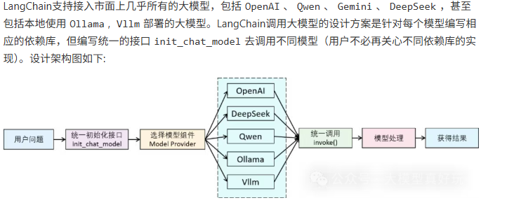

# Langchian

## langchain 核心模块和基本架构
- Model I/O
标准化各个大模型的输入和输出，包含输入模板，模型本身和格式化输出；
- Retrieval
检索外部数据，然后在执行生成步骤时将其传递到 LLM，包括文档加载、切割、Embedding等；
- Chains链
LangChain框架中最重要的模块，链接多个模块协同构建应用，是实际运作很多功能的高级抽象；
- Memory
记忆模块，以各种方式构建历史信息，维护有关实体及其关系的信息；
- Agents
目前最热门的Agents开发实践，未来能够真正实现通用人工智能的落地方案；
- Callbacks
回调系统，允许连接到 大模型 应用程序的各个阶段。用于日志记录、监控、流传输和其他任务；

### 1.1 大模型调用步骤
1. 安装大模型相关的依赖库
2. 使用init_chat_model 初始化大模型
3. 调用流程：

langchain 支持的模型供应商：https://python.langchain.com/docs/integrations/chat/
`model =init_chat_model(
model='Qwen/Qwen3-8B',
model_provider='openai',
base_url="https://api.siliconflow.cn/v1/",
api_key=""

)`
- 完整安装 LangChain（包含所有扩展依赖）
pip install langchain[all]