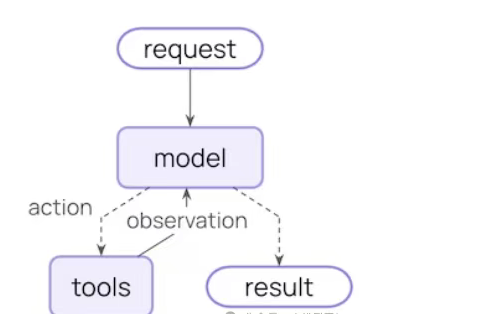
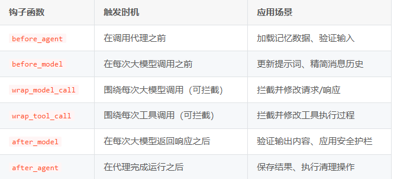

``# Langchian

## langchain 核心模块和基本架构
- Model I/O
标准化各个大模型的输入和输出，包含输入模板，模型本身和格式化输出；
- Retrieval
检索外部数据，然后在执行生成步骤时将其传递到 LLM，包括文档加载、切割、Embedding等；
- Chains链
LangChain框架中最重要的模块，链接多个模块协同构建应用，是实际运作很多功能的高级抽象；
- Memory
记忆模块，以各种方式构建历史信息，维护有关实体及其关系的信息；
- Agents
目前最热门的Agents开发实践，未来能够真正实现通用人工智能的落地方案；
- Callbacks
回调系统，允许连接到 大模型 应用程序的各个阶段。用于日志记录、监控、流传输和其他任务；

### 1.1 大模型调用步骤
1. 安装大模型相关的依赖库
2. 使用init_chat_model 初始化大模型
3. 调用流程：

langchain 支持的模型供应商：https://python.langchain.com/docs/integrations/chat/
`model =init_chat_model(
model='Qwen/Qwen3-8B',
model_provider='openai',
base_url="https://api.siliconflow.cn/v1/",
api_key=""

)`
- 完整安装 LangChain（包含所有扩展依赖）
pip install langchain[all]

## 以上是Langchain 0.x 的版本 后续皆为 1.x 的版本
1.0 优化了原本的LEC 结构

### 基本使用

1. creat_agent  基本使用
creat_agetn 是 1.0中构建agent 的标准方式，craet_agent 基于代理 循环模式（ReAct）构建图传递给大模型提示词和可执行工具列表，让大模型自行选择工具并自主决定调用工具的方式，并再获取足够信息后大模型自行结束流程

`from langchain.agents import create_agent
agent = create_agent( 
 model="claude-sonnet-4-5-20250929",
 tools=[search_web, analyze_data, send_email],
 system_prompt="You are a helpful research assistant.")

result = agent.invoke({
"messages": [
 {"role":"user",
 "content":"Research AI safety trends"}]})`

2. 中间件机制 

中间件机制是create_agent api的核心特性，智能体在执行过程中会经历多个关键时机，LangChain 在这些节点为开发者提供了高度定制的入口，可用于实现动态提示词控制、对话历史摘要、选择性工具调用、状态管理及安全护栏等功能，大幅提升了智能体的功能上限

**预制中间件**

同时LangChain 为常见场景也提供了预制的中间件
- PIIMiddleware:在发送至模型前自动屏蔽敏感信息
- SummarizationMiddleware:当对话历史过长时自动进行内容浓缩
- HumanInTheLoopMiddleware:敏感工具调用需经人工审批

**自定义中间件**

开发者也可基于智能体执行过程中暴露的钩子函数构建定制化中间件

3. 结构化输出
