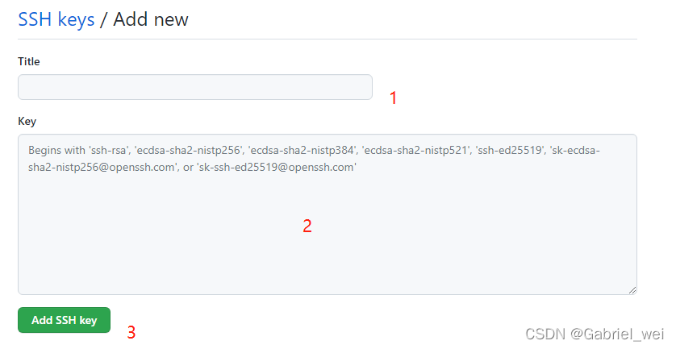

# git 相关使用

**设置这台电脑的Git用户信息**

- 获取本机Git用户名 ，如果之前没有设置过，回车以后Git返回为空
git config --global user.name

- 设置本机Git用户名
git config --global user.name '小红的台式机'

- 获取本机Git用户名邮箱， 如果之前没有设置过，回车以后Git返回为空
git config --global user.email

- 设置本机Git用户名邮箱 
git config --global user.email 'dd@qq.com'

## ssh
- 创建此电脑的 key
$ ssh-keygen -t rsa -C "123@126.com"
- 有点话可以，直接去 .ssh 查看

## GitHub配置
接下来到GitHub上，打开“Account settings”–“SSH Keys”页面，然后点击“Add SSH Key”，填上Title（随意写，但最好自己知道是什么意思），在Key文本框里粘贴 id_rsa.pub文件里的全部内容。

3.1转到ssh设置界面

3.2点击新增ssh

3.3 填写ssh信息

