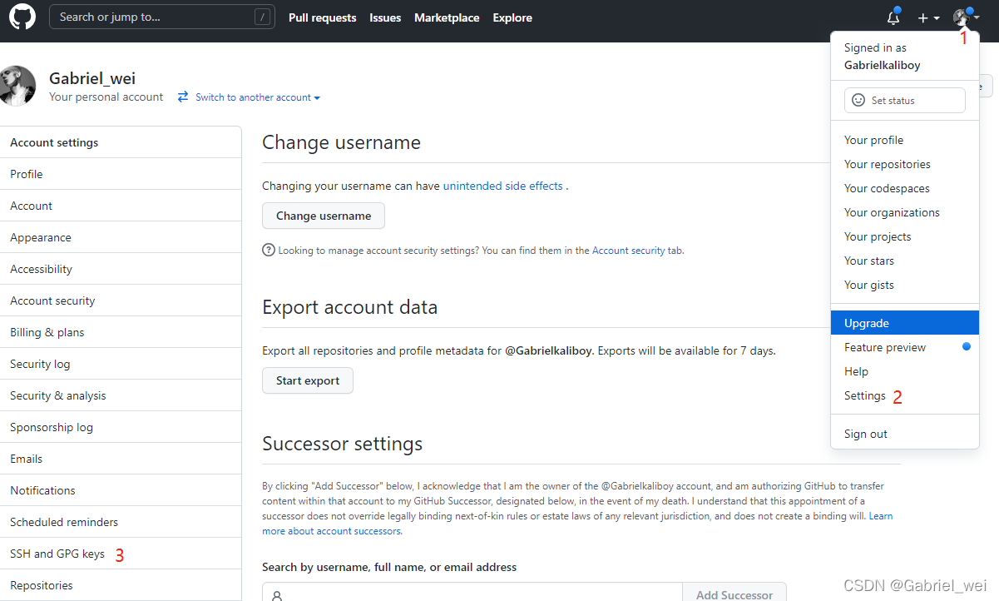
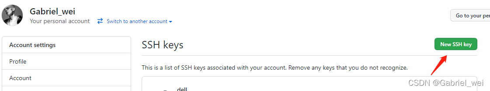
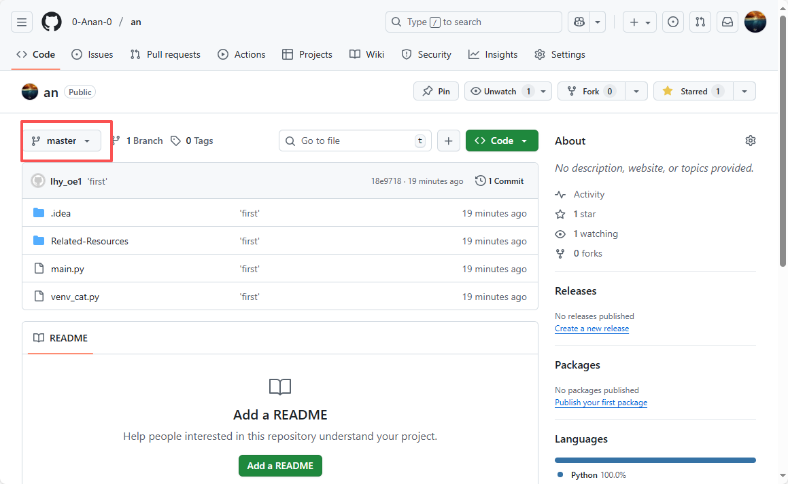

# git 相关使用

**设置这台电脑的Git用户信息**

- 获取本机Git用户名 ，如果之前没有设置过，回车以后Git返回为空
git config --global user.name

- 设置本机Git用户名
git config --global user.name '小红的台式机'

- 获取本机Git用户名邮箱， 如果之前没有设置过，回车以后Git返回为空
git config --global user.email

- 设置本机Git用户名邮箱 
git config --global user.email 'dd@qq.com'

## ssh
- 创建此电脑的 key
$ ssh-keygen -t rsa -C "123@126.com"
- 有点话可以，直接去 .ssh 查看

## GitHub配置
接下来到GitHub上，打开“Account settings”–“SSH Keys”页面，然后点击“Add SSH Key”，填上Title（随意写，但最好自己知道是什么意思），在Key文本框里粘贴 id_rsa.pub文件里的全部内容。

3.1转到ssh设置界面


3.2点击新增ssh


3.3 填写ssh信息


通过这个机制，您可以实时监控，确保计划可持续。如果需要扩展（如添加Kubernetes简介），根据日志反馈调整。

验证连接

在终端输入以下命令测试连接：

ssh -T git@github.com
复制
如果显示 Hi <username>! You've successfully authenticated...，则说明连接成功。

4. 初始化本地仓库并关联远程仓库

## 初始化本地仓库
- 初始化本地
git init

- 将本地仓库与 GitHub 仓库关联（替换 <repository-url> 为您的远程仓库地址）：
git remote add origin https://github.com/0-Anan-0/an.git

- 推送代码到远程仓库
添加文件到暂存区：
git add  文件   . 是所有文件

提交更改： 加上班备注 ''

git commit -m "首次提交"

推送代码到远程仓库：  当前分支是master 可调整分支  目前an 里面只有master分支

git push -u origin master

## 分支

## 额外指令
```# 初始化本地仓库（生成 .git 目录）
git init

# 克隆远程仓库（HTTPS/SSH 两种方式）
git clone https://github.com/0-Anan-0/an.git  # HTTPS 方式
git clone git@github.com:0-Anan-0/an.git       # SSH 方式（推荐）

# 克隆指定分支
git clone -b main https://github.com/0-Anan-0/an.git
# 查看文件状态（红=未追踪，绿=已暂存，??=新文件）
git status

# 追踪单个文件/所有文件到暂存区
git add 文件名.py       # 单个文件
git add .               # 所有修改（推荐，包含新增/修改，不含删除）
git add -A              # 所有修改（包含新增/修改/删除）

# 提交暂存区代码到本地仓库（必须写备注）
git commit -m "备注：修复XX问题/新增XX功能"

# 撤销暂存区的文件（回到工作区）
git reset HEAD 文件名.py

# 撤销工作区的修改（恢复到最近一次 commit 状态，慎用！）
git checkout -- 文件名.py

# 合并最近一次提交（修改 commit 备注/补充暂存文件）
git commit --amend -m "新的备注"

# 查看提交历史（简洁版，显示哈希值+备注+作者）
git log --oneline

# 查看详细提交历史（含修改内容）
git log -p

# 回滚到指定版本（哈希值取前6-8位即可）
git reset --hard 提交哈希值  # 彻底回滚（工作区+暂存区+本地仓库）
git reset --soft 提交哈希值  # 仅回滚仓库，暂存区/工作区保留修改

# 查看所有操作记录（包括 reset，用于找回误删版本）
git reflog

# 查看所有分支（* 表示当前分支）
git branch          # 本地分支
git branch -r       # 远程分支
git branch -a       # 所有分支（本地+远程）

# 创建新分支
git branch 分支名    # 仅创建，不切换
git checkout -b 分支名  # 创建并切换到新分支（常用）
git switch -c 分支名    # Git 2.23+ 替代 checkout 的新指令

# 切换分支
git checkout 分支名
git switch 分支名       # 新版推荐

# 删除分支
git branch -d 本地分支名  # 删除已合并的本地分支
git branch -D 本地分支名  # 强制删除未合并的本地分支
git push origin --delete 远程分支名  # 删除远程分支
`
